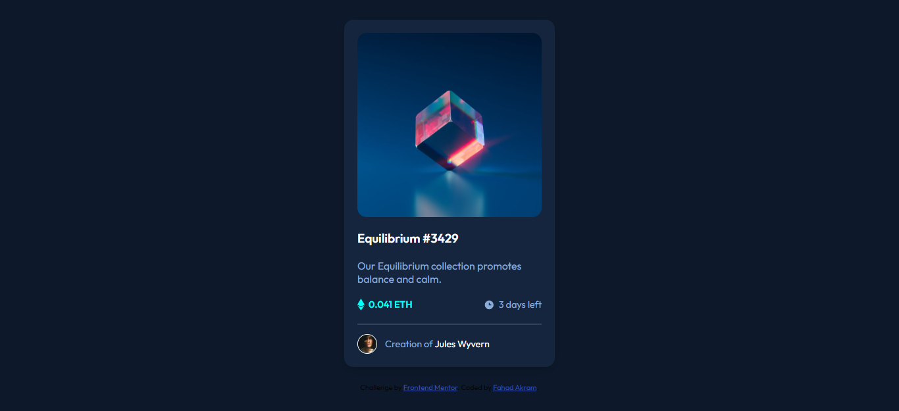

# Frontend Mentor - NFT preview card component solution

This is a solution to the [NFT preview card component challenge on Frontend Mentor](https://www.frontendmentor.io/challenges/nft-preview-card-component-SbdUL_w0U). Frontend Mentor challenges help you improve your coding skills by building realistic projects. 

## Table of contents

- [Overview](#overview)
  - [The challenge](#the-challenge)
  - [Screenshot](#screenshot)
  - [Links](#links)
- [Built with](#built-with)
- [Author](#author)

## Overview

### The challenge

Users should be able to:

- View the optimal layout depending on their device's screen size
- See hover states for interactive elements

### Screenshot

### Links

- Solution URL: https://github.com/FaDiiiLeo/nft-preview-card-component-main
- Live Site URL: https://fadiiileo.github.io/nft-preview-card-component-main/

### Built with

- Semantic HTML5 markup
- Flexbox
- Mobile-first workflow
- CSS Preprocessor (Sass)

## Author

- Frontend Mentor - [@FaDiiiLeo](https://www.frontendmentor.io/profile/FaDiiiLeo)
- LinkedIn - [Fahad Akram](https://www.linkedin.com/in/fahad-akram-88bb9222b/)
- Stack Overflow - [Fahad](https://stackoverflow.com/users/12165302/fahad)
